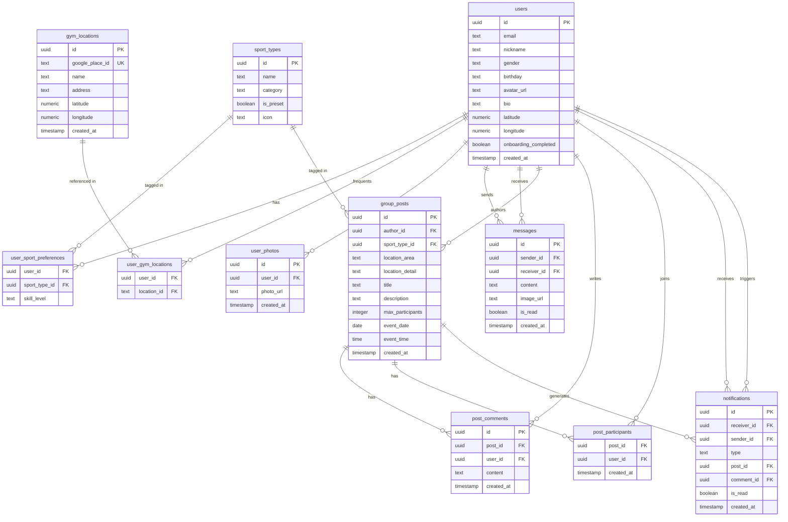
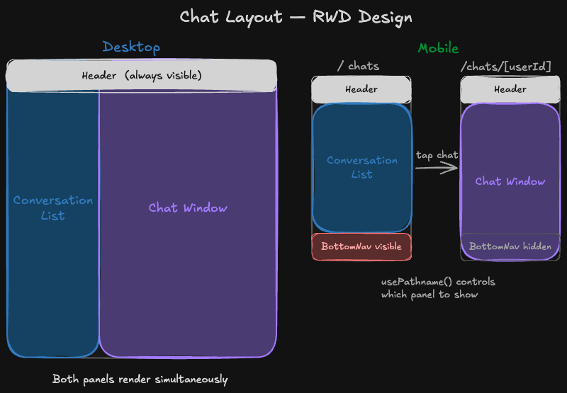

# Got You 咖揪 — Architecture Documentation

---

## Table of Contents

- [Project Overview](#project-overview)
- [Tech Stack](#tech-stack)
- [Database Schema](#database-schema)
- [Implementation Details](#implementation-details)
  - [Frontend](#frontend)
    - [1. Next.js App Router Route Groups + Proxy](#1-nextjs-app-router-route-groups--proxy)
    - [2. Chat Dual-Column Layout](#2-chat-dual-column-layout)
    - [3. Zustand Multi-Store Design](#3-zustand-multi-store-design)
    - [4. Realtime Subscription Strategy](#4-realtime-subscription-strategy)
    - [5. Optimistic Update](#5-optimistic-update)
  - [Backend](#backend)
    - [6. Compatibility Scoring RPC](#6-compatibility-scoring-rpc)
    - [7. Google Places Cache Layer](#7-google-places-cache-layer)
    - [8. Notification DB Triggers](#8-notification-db-triggers)
    - [9. Database RLS](#9-database-rls)
- [Contact](#contact)

---

## Project Overview

Got You 咖揪 is a sports social platform that helps users find compatible long-term training partners and organize one-time group activities. Discover people who match your lifestyle by shared gym locations or proximity using GPS, filtered by sport preference, age, and gender. Chat directly, join events, and build your sports community.

**Live URL**: https://got-you.vercel.app/

---

## Tech Stack

### Frontend

- **Framework**: Next.js 16 (App Router, Turbopack), React 19 (Hooks)
- **Language**: TypeScript
- **Styling**: Tailwind CSS v4, tailwind-merge, clsx
- **State Management**: Zustand
- **Forms & Validation**: React Hook Form + Zod
- **Animation**: Framer Motion

### Third-Party Libraries

- **Radix UI**
- **React DayPicker**
- **Day.js**
- **react-icons**
- **overlayscrollbars-react**
- **@vis.gl/react-google-maps**
- **linkify-it**

### Backend & Deployment

- **Supabase**
  - Auth
  - Database: PostgreSQL (with PostGIS extension)
  - Realtime
  - Storage
- **Google Places API**
- **Vercel**

---

## Database Schema

| Table                     | Description                                                         |
| ------------------------- | ------------------------------------------------------------------- |
| `users`                   | User profiles with geolocation fields                               |
| `sport_types`             | Preset sport type options                                           |
| `user_sport_preferences`  | User sport preferences (many-to-many)                               |
| `gym_locations`           | Place cache from Google Places API                                  |
| `user_gym_locations`      | User frequent gym locations (many-to-many)                          |
| `user_photos`             | Lifestyle photo URLs                                                |
| `group_posts`             | Sports meetup posts                                                 |
| `post_comments`           | Post comments                                                       |
| `post_participants`       | Post join records                                                   |
| `messages`                | Chat messages (sender_id, receiver_id, content, image_url, is_read) |
| `conversation_visibility` | One-way conversation hide state                                     |
| `blocked_users`           | Block list                                                          |
| `notifications`           | Group post notifications (post_comment, post_join, comment_thread)  |



---

## Implementation Details

### Frontend

---

#### 1. Next.js App Router Route Groups + Proxy

Used `(auth)` and `(main)` route groups to apply separate layouts — auth pages use a minimal full-screen layout while main app pages share a responsive navigation layout. Route protection is handled in `proxy.ts`, which intercepts all requests to redirect unauthenticated users to `/login` and prevent authenticated users from accessing auth pages.

```
app/
├── (auth)/        # login, signup — minimal layout
├── (main)/        # explore, posts, chats, profile — responsive nav layout
├── onboarding/
└── page.tsx       # Landing Page
```

---

#### 2. Chat Dual-Column Layout

The chat section uses a persistent layout defined in `chats/layout.tsx`. On desktop, it renders a two-column view — conversation list on the left, active chat on the right. On mobile, only one panel is shown at a time: the list or the chat window. `usePathname` determines which panel to display, and `BottomNav` is hidden entirely when inside a chat conversation to maximize screen space.

> 📊 **Diagram**: Chat Layout RWD Design
> 

---

#### 3. Zustand Multi-Store Design

The app uses five Zustand stores, each with a single responsibility. `useAuthStore` manages Supabase Auth session data, while `useUserStore` holds the current user's full profile from `public.users` — separating auth-layer concerns from app-layer data. `useExploreStore` manages filter state and active tab. `useChatStore` tracks total unread count and the current open conversation, with a Realtime subscription initialized globally in `AuthInitializer`. `useNotificationStore` handles group post notifications and unread count.

**Why global state for each store:**

| Store                  | Manages                                     | Why global                                                          |
| ---------------------- | ------------------------------------------- | ------------------------------------------------------------------- |
| `useAuthStore`         | Login state, user session                   | Every page needs to know if the user is authenticated               |
| `useUserStore`         | Current user's full profile                 | Shared across multiple pages, avoids redundant fetches              |
| `useExploreStore`      | Filter conditions, active tab               | Keeps filter state in sync across components                        |
| `useChatStore`         | Total unread count, current conversation ID | Unread count must be visible across multiple pages in both nav bars |
| `useNotificationStore` | Notification list, unread count             | Decouples the floating bell UI from its data source                 |

> 📊 **Diagram**: Zustand Store Architecture
> 

---

#### 4. Realtime Subscription Strategy

The app maintains six Supabase Realtime channels across four components, each scoped to the authenticated user and cleaned up on unmount.

| Component         | Table               | Event                                                                                               | Purpose                                                     |
| ----------------- | ------------------- | --------------------------------------------------------------------------------------------------- | ----------------------------------------------------------- |
| AuthInitializer   | `messages`          | `*` where `receiver_id = me`                                                                        | Re-fetch total unread count (excludes current conversation) |
| AuthInitializer   | `notifications`     | INSERT where `receiver_id = me`                                                                     | Update notification unread count in bell                    |
| ChatList          | `messages`          | INSERT where `receiver_id = me`<br>INSERT where `sender_id = me`<br>UPDATE where `receiver_id = me` | Re-fetch chat preview list                                  |
| ChatWindow        | `messages`          | INSERT where `receiver_id = me`<br>(JS callback filters `sender_id = partner`)                      | Render incoming message + mark as read                      |
| `/posts/[postId]` | `post_comments`     | INSERT                                                                                              | Render new comment in real time                             |
| `/posts/[postId]` | `post_participants` | INSERT / DELETE                                                                                     | Update participant list and count                           |

**Known issues:**

- ChatList Realtime callback has stale closure risk — `lastPath` is tracked via `useRef` to always reference the latest route value.
- ChatWindow subscribes broadly on `receiver_id`, then filters by `sender_id` inside the JS callback — DB-level filter for performance, JS-level filter for precision.

---

#### 5. Optimistic Update

The chat Realtime subscription only listens on `receiver_id` — outgoing messages are outside its scope. Even if `sender_id` were subscribed, the message would still need to wait for DB write confirmation before appearing, causing the input to freeze and a visible delay.

Optimistic update solves this by immediately rendering a temporary message (with a `tempId`) and clearing the input before the DB write completes. If the write succeeds, no further action is needed — the UI is already correct. If it fails, the temporary message is removed by `tempId` and the input content is restored (rollback).

**Flow:**

```
User hits send
  → Save input value
  → Clear input + render temp message (tempId)   ← user sees instantly
  → Background DB write
      ├── success: no action needed (UI already correct)
      └── fail: remove temp message (tempId) + restore input (rollback)
```

> 📊 **Diagram**: Optimistic Update — Sending Chat Messages
> 

---

### Backend

---

#### 6. Compatibility Scoring RPC

Compatibility scoring is handled by a PostgreSQL RPC function `get_recommended_users`, rather than in the frontend. Sorting by a computed score on the frontend would only rank users within the current page, not across all results — placing the sort logic in the database ensures globally correct ordering regardless of pagination offset.

When `active_tab = shared_gym`, users are sorted by weighted compatibility score. When `active_tab = nearby`, the function falls back to sorting by GPS distance (nearest first) via PostGIS.

**Scoring weights:**

| Factor                        | Score        |
| ----------------------------- | ------------ |
| Shared gym location           | +5 per match |
| Shared sport preference       | +3 per match |
| Age difference within 5 years | +2           |
| Same gender                   | +1           |

---

#### 7. Google Places Cache Layer

`gym_locations` serves as a local cache and reference table for place data fetched from Google Places API. When a user selects a location from the autocomplete suggestions, the app checks if the `google_place_id` already exists in `gym_locations`. If it does, the record is reused directly — no API call needed. If not, it calls `place.fetchFields()` to retrieve full details and upserts the record.

This approach serves two purposes: it ensures all users reference the same canonical place data (preventing mismatches from manual input), and allows explore filtering to run entirely against the local database without depending on the Google Places API at query time.

**Flow:**

```
User selects autocomplete suggestion
  → get place.id (google_place_id)
  → check gym_locations table
      ├── exists: write to user_gym_locations directly
      └── not found: place.fetchFields() → upsert gym_locations → write to user_gym_locations
```

---

#### 8. Notification DB Triggers

Rather than handling notification creation in the frontend, the app uses PostgreSQL triggers to automatically write to the `notifications` table on relevant events. Two triggers are defined:

- `on_post_comment_insert` → calls `handle_post_comment_notification()`
  - `post_comment`: notifies the post author when a new comment is added
  - `comment_thread`: notifies all users who have previously commented on the same post (excludes post author and the commenter themselves)

- `on_post_join_insert` → calls `handle_post_join_notification()`
  - `post_join`: notifies the post author when a user joins

This keeps notification logic close to the data, ensures no notification is missed regardless of client state, and avoids extra round-trips from the frontend. All notifications are consumed by `useNotificationStore` via a Realtime subscription on the `notifications` table.

> 📊 **Diagram**: Notification DB Triggers
> 

---

#### 9. Database RLS

Row Level Security (RLS) is enabled on all sensitive tables. Policies ensure users can only read and write data they are authorized to access. Supabase's `auth.uid()` is used in all policy conditions to enforce this at the database level, independent of frontend logic.

**Example policies:**

```sql
-- Users can only read messages they sent or received
USING (auth.uid() = sender_id OR auth.uid() = receiver_id)

-- Users can only send messages as themselves
WITH CHECK (auth.uid() = sender_id)

-- Any authenticated user can view group posts
USING (auth.role() = 'authenticated')

-- Only post authors can delete their own posts
USING (auth.uid() = author_id)
```

---

## Contact

Eric Fan

- Email: fyh0225@gmail.com
- LinkedIn: https://www.linkedin.com/in/yuan-hung-fan-6b06b3275/
- GitHub: https://github.com/eriiic0225/Got-You
