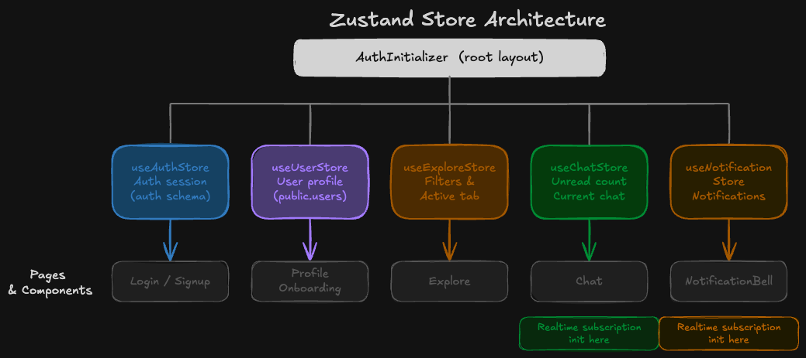
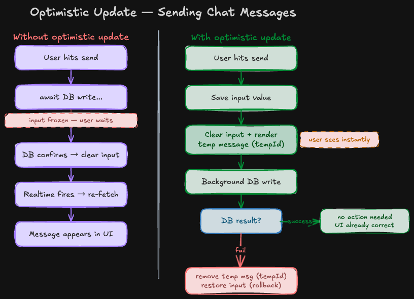
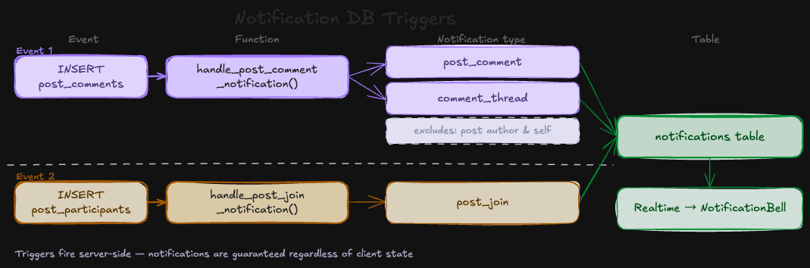

  <a href="#zh-tw">繁體中文</a> | <a href="#en">English</a>

---

<h2 id="en">English</h2>

<!-- Banner -->

# Got You 咖揪

Find your next workout partner or sports crew — by shared gym, distance, and what you play.

Got You is a sports social platform for finding compatible long-term training partners and organizing one-time group activities. Discover people who match your lifestyle by shared gym locations or proximity using GPS, filtered by sport preference, age, and gender. Chat directly, join events, and build your sports community.

**Live URL**: https://got-you.vercel.app/

> No email verification required — enter any `xxx@xxx.com` format email (e.g. `test@test.com`) and a 6-character password to register and experience the full onboarding flow.

---

## Table of Contents

- [Demo](#demo)
  - [Landing](#landing)
  - [Onboarding](#onboarding)
  - [Explore](#explore)
  - [Chat](#chat)
  - [Group Posts](#group-posts)
- [Main Features](#main-features)
- [Tech Stack](#tech-stack)
  - [Frontend](#frontend)
  - [Third-Party Libraries](#third-party-libraries)
  - [Backend & Deployment](#backend--deployment)
- [Implementation](#implementation)
- [Contact](#contact)

---

## Demo

### Landing

> Smooth animations and sport category carousel on the landing page.

### Onboarding

> Sign up and complete your profile — sport preferences and frequent gym locations.

### Explore

> Browse recommended training partners by shared gym or GPS proximity. Filter by sport, gender, and age. Search by nickname, location name, or address.

### Chat

> Real-time one-on-one messaging with image support (upload or Ctrl+V paste). Unread count synced across the app.

### Group Posts

> Create and browse sports meetups. Filter by sport type. Join events and leave comments in real time.

---

## Main Features

- **Authentication** — Sign up and log in with email or Google account, supported by Supabase Auth
- **Onboarding Flow** — New users set up their profile, sport preferences, and frequent gym locations step by step. Gym locations are selected via Google Places Autocomplete to ensure standardized place data across all users.
- **Profile** — View your own and others' public profiles; edit personal info, sport preferences, gym locations, and upload lifestyle photos anytime after onboarding. Gym locations are selected via Google Places Autocomplete — ensuring all users reference the same standardized place data regardless of how they might spell it.
- **Explore** — Discover compatible training partners via two modes: shared gym locations or GPS-based proximity (powered by PostGIS); filter by sport, gender, and age
- **Group Posts** — Create and browse one-time sports meetups with quick-filter tags and an advanced filter modal; join or leave events in real time
- **Real-time Chat** — One-on-one messaging with image support (upload or paste); preview images before sending; unread count synced across the app via Supabase Realtime
- **Notification System** — Bell icon for group post activity (new comments, new participants, comment threads); chat tab red dot for unread messages

---

## Tech Stack

### Frontend

- **Framework**: Next.js 16 (App Router, Turbopack), React 19 (Hooks)
- **Language**: TypeScript
- **Styling**: Tailwind CSS v4, tailwind-merge, clsx
- **State Management**: Zustand
- **Forms & Validation**: React Hook Form + Zod
- **Animation**: Framer Motion

### Third-Party Libraries

- Radix UI
- React DayPicker
- Day.js
- react-icons
- overlayscrollbars-react
- @vis.gl/react-google-maps
- linkify-it

### Backend & Deployment

- **Supabase**
  - Auth
  - Database: PostgreSQL (with PostGIS extension)
  - Realtime
  - Storage
- **Maps**: Google Places API
- **Deployment**: Vercel

---

## Implementation

#### 1. Next.js App Router Route Groups + Proxy

Used `(auth)` and `(main)` route groups to apply separate layouts. Route protection is handled in `proxy.ts` — unauthenticated users are redirected to `/login`, and authenticated users are redirected away from login and signup pages, improving navigation flow.

#### 2. Chat Dual-Column Layout

The chat section renders a two-column view on desktop and switches to a single-panel layout on mobile via `usePathname`. `BottomNav` is hidden when inside a chat conversation to prevent accidental taps while typing and to maximize screen space.

#### 3. Zustand Multi-Store Design

The app uses five Zustand stores, each with a single responsibility. `useAuthStore` and `useUserStore` are intentionally separated — the former handles Supabase Auth session data (auth schema), the latter holds the current user's full profile from `public.users`.

#### 4. Realtime Subscription Strategy

The app maintains six Supabase Realtime channels across four components, each scoped to `user.id = me` and cleaned up on unmount. ChatList subscribes to three events on the `messages` table; ChatWindow subscribes where `receiver_id = me` and filters by `sender_id = current chat partner` inside the JS callback for precision.

| Component         | Table               | Event                                                                                               | Purpose                                                     |
| ----------------- | ------------------- | --------------------------------------------------------------------------------------------------- | ----------------------------------------------------------- |
| AuthInitializer   | `messages`          | `*` where `receiver_id = me`                                                                        | Re-fetch total unread count (excludes current conversation) |
| AuthInitializer   | `notifications`     | INSERT where `receiver_id = me`                                                                     | Update notification unread count in bell                    |
| ChatList          | `messages`          | INSERT where `receiver_id = me` INSERT where `sender_id = me` UPDATE where `receiver_id = me` | Re-fetch chat preview list                                  |
| ChatWindow        | `messages`          | INSERT where `receiver_id = me` (JS callback filters `sender_id = current chat partner`)         | Render incoming message + mark as read                      |
| `/posts/[postId]` | `post_comments`     | INSERT                                                                                              | Render new comment in real time                             |
| `/posts/[postId]` | `post_participants` | INSERT / DELETE                                                                                     | Update participant list and count                           |

#### 5. Optimistic Update

Rather than waiting for DB confirmation, outgoing messages are rendered immediately — clearing the input and displaying a temporary message so the user never experiences a freeze or delay. On failure, the temporary message is removed and the input is restored (rollback).

#### 6. Compatibility Scoring RPC

Compatibility scoring is handled by a PostgreSQL RPC function `get_recommended_users`. Sorting at the database level ensures globally correct ordering regardless of pagination offset. When `active_tab = nearby`, the function falls back to GPS distance sorting via PostGIS.

| Factor                        | Score        |
| ----------------------------- | ------------ |
| Shared gym location           | +5 per match |
| Shared sport preference       | +3 per match |
| Age difference within 5 years | +2           |
| Same gender                   | +1           |

#### 7. Google Places Cache Layer

`gym_locations` serves as a local cache for Google Places API data. On location select, the app checks if the `google_place_id` exists locally — reusing it if found, or calling `place.fetchFields()` and upserting if not. This reduces redundant paid API calls, ensures canonical place data across all users, and allows explore filtering to run entirely against the local database.

#### 8. Notification DB Triggers

Two PostgreSQL triggers automatically write to the `notifications` table when users comment on or join a post. This keeps notification logic at the database level, ensuring notifications are delivered regardless of client state.

#### 9. Database Structure & RLS

Row Level Security is enabled on all sensitive tables, enforcing access control at the database level independent of frontend logic.

---

## Contact

Eric Fan

- Email: fyh0225@gmail.com
- LinkedIn: https://www.linkedin.com/in/yuan-hung-fan-6b06b3275/
- GitHub: https://github.com/eriiic0225/Got-You

---

---

<h2 id="zh-tw">繁體中文</h2>

<!-- Banner -->

# Got You 咖揪

透過常去地點、附近距離與運動偏好，找到志同道合的夥伴——揪人一起練，或加入附近的活動。

Got You 咖揪是一個運動社交平台，幫助你找到長期訓練夥伴，或發起、加入一次性的運動活動。透過共同的運動地點或 GPS 距離定位，搭配運動偏好、年齡、性別篩選，找到和你 Lifestyle 契合的人。直接開聊、參加揪團，建立你的運動生活圈。

**Live URL**: https://got-you.vercel.app/

> 測試期間 Email 無需驗證，輸入任意符合 `xxx@xxx.com` 格式的 Email（如 `test@test.com`）及 6 字元以上密碼即可完成註冊，體驗完整的 Onboarding 流程。

---

## 目錄

- [Demo](#demo-1)
  - [Landing](#landing-1)
  - [Onboarding](#onboarding-1)
  - [Explore](#explore-1)
  - [Chat](#chat-1)
  - [Group Posts](#group-posts-1)
- [主要功能](#主要功能)
- [技術棧](#技術棧)
  - [前端](#前端)
  - [第三方套件](#第三方套件)
  - [後端--部署](#後端--部署)
- [技術實作](#技術實作)
- [聯絡方式](#聯絡方式)

---

## Demo

### Landing

> Landing Page 動態效果與運動類別輪播展示。

### Onboarding

> 註冊並完成個人設定——填寫運動偏好與常去地點。

### Explore

> 依共同地點或 GPS 距離瀏覽推薦夥伴，支援運動、性別、年齡篩選，以及暱稱、地點名稱或地址搜尋。

### Chat

> 即時一對一聊天，支援圖片傳送（上傳或 Ctrl+V 貼上），未讀數全站同步。

### Group Posts

> 發佈與瀏覽揪團活動，依運動類型篩選，即時參加與留言。

---

## 主要功能

- **會員系統** — 支援 Email 或 Google 帳號註冊登入，由 Supabase Auth 驅動
- **Onboarding 引導流程** — 新用戶逐步完成個人資料、運動偏好與常去地點設定。常去地點透過 Google Places Autocomplete 選取，確保所有用戶使用一致的標準化地點資料。
- **個人頁面** — 瀏覽自己與他人的公開頁面；Onboarding 後可隨時編輯基本資料、運動偏好、常去地點並上傳生活照。常去地點透過 Google Places Autocomplete 選取，確保所有用戶使用一致的標準化地點資料，消除自行輸入造成的名稱誤差。
- **探索** — 透過兩種模式探索合適的訓練夥伴：共同常去地點或 GPS 定位（由 PostGIS 驅動）；支援運動、性別、年齡篩選
- **揪團** — 發佈與瀏覽一次性運動活動，支援快速篩選標籤與進階篩選；即時參加或退出
- **即時聊天** — 一對一訊息，支援圖片傳送（上傳或貼上）與預覽；未讀數透過 Supabase Realtime 全站同步
- **通知系統** — 揪團相關活動（新留言、新參加者、留言串）顯示於 Header 鈴鐺；聊天未讀數顯示於 Tab 紅點

---

## 技術棧

### 前端

- **框架**: Next.js 16 (App Router, Turbopack), React 19 (Hooks)
- **語言**: TypeScript
- **樣式**: Tailwind CSS v4, tailwind-merge, clsx
- **狀態管理**: Zustand
- **表單驗證**: React Hook Form + Zod
- **動畫**: Framer Motion

### 第三方套件

- Radix UI
- React DayPicker
- Day.js
- react-icons
- overlayscrollbars-react
- @vis.gl/react-google-maps
- linkify-it

### 後端 & 部署

- **Supabase**
  - Auth
  - Database: PostgreSQL（with PostGIS extension）
  - Realtime
  - Storage
- **地圖**: Google Places API
- **部署**: Vercel

---

## 技術實作

#### 1. Next.js App Router Route Groups + Proxy

使用 `(auth)` 與 `(main)` 路由分群套用不同 Layout。路由保護由 `proxy.ts` 處理——未登入者導向 `/login`，已登入者自動從登入及註冊頁面導離，提升使用者體驗。

#### 2. Chat 雙欄 Layout 設計

聊天頁在桌機顯示雙欄，手機端透過 `usePathname` 判斷只顯示單一面板。進入聊天室時隱藏 `BottomNav`，防止打字時誤觸，並最大化畫面空間。

#### 3. Zustand 多 Store 設計

App 使用五個 Zustand Store，各自負責單一職責。`useAuthStore` 與 `useUserStore` 刻意分開——前者管理 Supabase Auth session（auth schema），後者存放來自 `public.users` 的完整用戶資料。

#### 4. 即時訂閱策略

App 在四個元件中維護六條 Supabase Realtime channel，皆以 `user.id = me` 限定範圍並在 unmount 時清除。ChatList 訂閱 `messages` 表的三種事件；ChatWindow 訂閱 `receiver_id = me` 的訊息，再於 JS callback 中以 `sender_id = 目前聊天對象` 精確過濾。

| Component         | Table               | Event                                                                                               | Purpose                                                     |
| ----------------- | ------------------- | --------------------------------------------------------------------------------------------------- | ----------------------------------------------------------- |
| AuthInitializer   | `messages`          | `*` where `receiver_id = me`                                                                        | Re-fetch total unread count (excludes current conversation) |
| AuthInitializer   | `notifications`     | INSERT where `receiver_id = me`                                                                     | Update notification unread count in bell                    |
| ChatList          | `messages`          | INSERT where `receiver_id = me` INSERT where `sender_id = me` UPDATE where `receiver_id = me` | Re-fetch chat preview list                                  |
| ChatWindow        | `messages`          | INSERT where `receiver_id = me` (JS callback filters `sender_id = current chat partner`)         | Render incoming message + mark as read                      |
| `/posts/[postId]` | `post_comments`     | INSERT                                                                                              | Render new comment in real time                             |
| `/posts/[postId]` | `post_participants` | INSERT / DELETE                                                                                     | Update participant list and count                           |

#### 5. 樂觀更新

送出訊息時不等待 DB 確認，立即清空輸入框並渲染暫時訊息，讓使用者感受不到任何停頓或等待。失敗時移除暫時訊息並還原輸入內容（rollback）。

#### 6. 相似度評分 RPC

相似度計算由 PostgreSQL RPC 函式 `get_recommended_users` 處理，在資料庫層排序確保分頁正確性。`active_tab = nearby` 時 fallback 為 PostGIS GPS 距離排序。

| Factor                        | Score        |
| ----------------------------- | ------------ |
| Shared gym location           | +5 per match |
| Shared sport preference       | +3 per match |
| Age difference within 5 years | +2           |
| Same gender                   | +1           |

#### 7. Google Places 快取層

`gym_locations` 作為 Google Places API 資料的本地快取。選取地點時先查詢 `google_place_id` 是否存在——存在則直接使用，否則呼叫 `place.fetchFields()` 並 upsert。減少重複的付費 API 呼叫，同時確保所有用戶使用一致的標準化地點資料，探索篩選完全在本地資料庫完成。

#### 8. 通知 DB Trigger

兩個 PostgreSQL Trigger 在用戶留言或參加揪團時，自動寫入 `notifications` 表。通知邏輯集中在資料庫層，確保無論客戶端狀態如何，通知都能確保送達。

#### 9. 資料庫結構及 Database RLS

所有敏感資料表均啟用 Row Level Security，在資料庫層強制存取控制，不依賴前端邏輯。

---

## 聯絡方式

Eric Fan

- Email: fyh0225@gmail.com
- LinkedIn: https://www.linkedin.com/in/yuan-hung-fan-6b06b3275/
- GitHub: https://github.com/eriiic0225/Got-You
